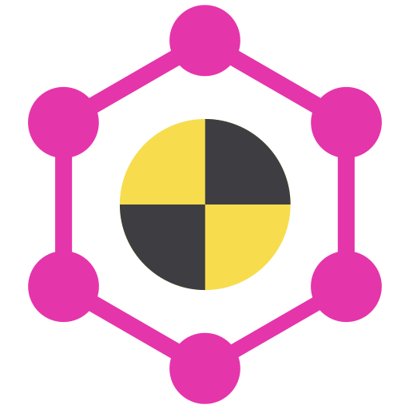

  
  <h1 align="center">graphql-test-resolvers</h1>

This project contains tools to build and mock GraphQL APIs using resolvers.
It includes resolver wrappers that provide testing context, integrations with [Mirage JS](https://miragejs.com/)
for stateful queries, and resolver map middlewares to create useful testing helpers.

Check out the [documentation](https://chadian.github.io/graphql-test-resolvers/) for more information.